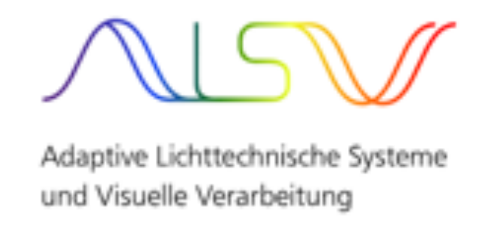

  
  &nbsp;&nbsp;&nbsp;&nbsp;
  

# IHC 2026 Horticulture PCB

## Manuscript

**Development of a low-cost, open-source modular sensor platform for dynamic vertical farms with PPFD prediction using the AS7343 multispectral sensor**

The project files will be published after the IHC 2026 in Kyoto.

## Contact
If you want to stay in contact during or after the conference, please write to:
Felix Wirth 
[wirth@lichttechnik.tu-darmstadt.de](mailto:wirth@lichttechnik.tu-darmstadt.de)

## Affiliation

[Laboratory of Adaptive Lighting Systems and Visual Processing (ALSVV)](https://www.lichttechnik.tu-darmstadt.de/), Technische Universität Darmstadt, Germany